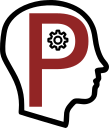

 

# pyFlies

A Domain-Specific Language (DSL) for experiments specification in cognitive sciences

---

[pyFlies](https://github.com/pyflies/pyflies/) is a Domain-Specific
Language (DSL) for cognitive experiments modeling. It is meant to be highly
readable and simple to learn. The aim of the language is to capture the essence
of the experiment and to leave the details to the compiler.

A code for various run-time platforms can be generated from the experiment
description. Currently [PsychoPy](https://www.psychopy.org/) is fully supported
and we plan to build generators for other targets.

**Features:**

 * High-level. Easy to write and read. Experiments can be defined in minutes!
 * From experiment description a source code for various platforms can be
   automatically generated. 
 * Declarative language. Specify `what` needs to be done and leave `how` part to
   the pyFlies.
 * Integrates in [VS Code](https://code.visualstudio.com/). One of the most
   popular code editors today.
 * Written in Python programming language. Easy to extend. Generators are
   plugins which can be developed independently.
 * Fully free and open source. GPL license.
   [Hosted on github](https://github.com/pyflies/pyflies). Easy to contribute to.

## Getting started

### Installation

Install [Python](https://www.python.org/) and check that it is available on the
command line by running:

    python --version

It is recommended to use [Python virtual
environments](https://docs.python.org/3/library/venv.html) to isolate different
set of Python libraries. Create virtual environment for pyFlies by running:

    python -m venv pyflies-venv
    
This will create folder `pyflies-venv` where your libraries will be installed.

You need to activate virtual environment before usage:

    source pyflies-venv/bin/activate    (for Linux and other POSIX systems)
    pyflies-env\Scripts\activate.bat    (for Windows)

Now, you can install pyFlies and generator for PsychoPy with:

    pip install pyflies-psychopy

To verify that pyFlies is installed you can run:

    textx list-generators
    
You can see in the output that the generator pyFlies -> PsychoPy is available.

pyFlies specifications are pure text and can be edited by any textual editor but
for a good experience (especially with tables) it is recommended that VS Code
and pyFlies extension is used.

Install VS Code either for you OS package manager or by going to [VS Code
download page](https://code.visualstudio.com/download) and downloading package
for your operating system. In the list of extensions find pyFlies and click on
`install`.

!!! note

    You can watch the process of installation in [this video](). In the video we
    are using Linux but most of the information is valid for other OSes.

### Video tutorials

The best way to start with pyFlies is by watching some of our video tutorials.

### Try examples

Clone or [download](https://github.com/igordejanovic/pyFlies/archive/master.zip)
pyFlies repo. Unpack and load examples from `examples` folder in the editor or
pyFlies GUI. Update experiment definition to your taste. Generate and run experiment.

### Discuss, ask questions

For all questions, feature requires and bug report please use [the GitHub issue tracker]()

## Screenshots (click for a popup)

### Editing specification

Experiment is created and modified in a convenient to use editor.

### Generated log

From an experiment specification a full log of the experiment flow is generated
which can be used to investigate and debug the experiment.

### Generated PsychoPy code

From an experiment specification Python code for PsychoPy is generated which is
used to run the experiment.

## Credits

pyFlies icon is based on an icon licensed by CC BY 3.0 from [Icon Fonts](http://www.onlinewebfonts.com/icon).
