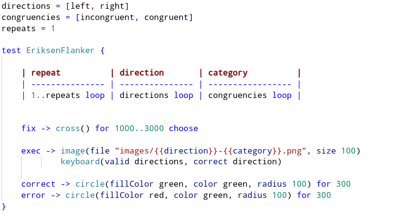
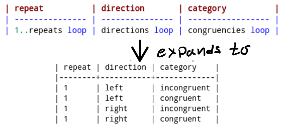

# Test definition

---

A test represents the main concept in pyFlies language. Each test has a name, a
condition table defining variables and their values for each trial, and
component specifications with mapping to trials.

On this page we will use an example to show how tests are defined and we will
provide references to other pages describing each segment of the definition in
more details.

Here is an example of a test:

The example represents the definition of the Eriksen Flanker task published in:

    Eriksen, B. A.; Eriksen, C. W. (1974). "Effects of noise letters upon
    identification of a target letter in a non- search task". Perception and
    Psychophysics. 16: 143–149.

The target is flanked by non-target stimuli which correspond either to
the same directional response as the target (congruent flankers), to the
opposite response (incongruent flankers). In this example we are using arrows
which points to the left or to the right. The surrounding non-target stimuli
will be congruent (points to the same direction), or incongruent (points to the
opposite direction).

Before the test we have three variables defined which we shall use in the test:
`directions` - a list of directions, `congruencies` - a list of congruencies as
each trial can be either congruent or inconguruent, and `repeats` - a number of
repeats we shall use to change the total number of trials during the test run.

There are three variables defined in the header of the table of conditions:
`repeat` - used to control total number of trials per test run, `direction` -
contains the direction of the target stimuli, `category` - holds information if
the current trial is congruent or not.

## Test table expansion

Values of each trial variable is given as an expression in the table first
non-header row. You can see that each expression is a `loop` expression which
will loop over the given sequence to expand the table. Loops are evaluated from
left to right, leftmost loop being the top-level outer loop while the rightmost
loop being the inner loop. We could also have a sequence without the loop in
which case the sequence would cycle, or any other expression involving global
and trail variables and literal values.

For `repeats` value of `1`, as defined globally, this table expands as follow:

We could as well write condition table in the expanded style but it would be
less flexible as it would be harder to add new variables, to use `repetition`
for total number of trials etc. For the details of condition table specification
and expansion see [Condition Tables](condition-tables.md) section.

!!! tip

    Although, pyFlies specifications are just plain textual files and can be edited
    in any text editor, it is much more convenient to edit tables in editor that
    supports them, like provided [VS Code pyFlies extension]().

## Components specification

The second part of the test definition are mappings of components to trials.
These mappings define the components (stimuli and inputs), their timings and
conditions under which they should be shown to the user.

These mappings are given in the form:

        <condition> -> <list of components with timings>
        
        
where left-hand side (LHS) `<condition>` is boolean expression which when
evaluated to `true` in the context of the current trial means that the
components on the right side are used in the trial.

## Trial phases

For better organization, each trial execution is separated in the three phases:
`fix`, `exec` and `error/correct`. The phases are executed in succession and for
each execution builtin boolean variables `fix`, `exec`, `error`, `correct` get
value of `true` for corresponding phase, thus those variables can be used in LHS
expressions to match the phase.

In the above example we have `fix -> cross..`. LHS condition is just `fix`
variable which will be `true` during `fix` phase of each trial. Thus, `cross`
component will be shown to the user during each `fix` phase. If we wanted, for
example, to show `cross` only for `odd` trials we could write:

    fix and parity == odd -> cross() for 1000

Notice the part of the definition `for 1000`. Each component can optionally
define its duration in miliseconds. Here we specify that the cross component
will be shown for 1s. If duration is not provided it means indefinitely and the
component will last until the end of the phase. We usually use indefinite
durations when we have input components which terminate phases on user input.

!!! tip

    [Expressions](expressions.md) are used almost everywhere and they can range from
    just a simple literal value to a more complex expressions using local and global
    variables.

In the `exec` phase we have two components `image` and `keyboard`. First
component will display the given image, and the second will wait for the user
input. The `image` component has `file` defined as variable string created by
interpolating `direction` and `category` values from the current trial. All
strings support powerful templating provided by the [Jinja template
engine](https://jinja.palletsprojects.com/).

`keyboard` component has two parameters: `valid` - a list of valid keys, and
`correct` - what is considered a correct response. Notice that we have defined
valid keys and correct response in abstract terms representing directions.
pyFlies tries to capture the essence of the test and thus parameters and
variables are defined in abstract terms. The detailed mapping is provided by the
code generator and the default mappings can be overriden by the [`target`
configuration](targets.md)

At the end we specify what will happen in `correct` and `error` phases of the
trial. We choose to show green or red circle but we could also choose to play
sounds, or we could leave these phases out if we don't want it. Remember that
`correct` and `error` are just boolean variables that are `true` during phase
calculation.

Each trial must have components defined for at least `exec` phase (i.e.
evaluation for `exec == true` must yield components to show). If that is not
satisfied the error will be reported during compilation.

